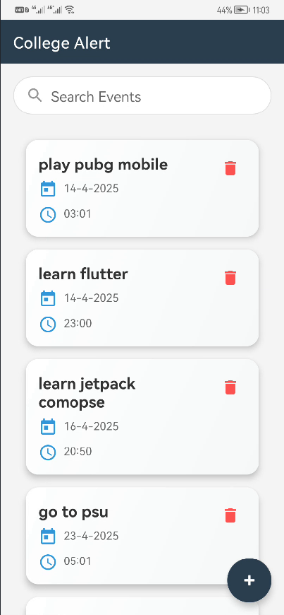
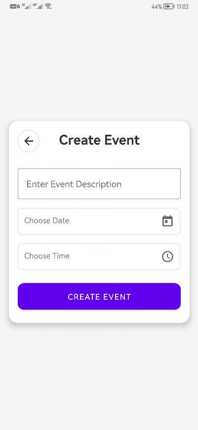

# 📝 Smart To-Do App (Kotlin + Room + Notifications)

A modern and intelligent To-Do application built with **Kotlin** that allows users to add and manage tasks with automatic **local notifications**.  
It uses **Room** for local database management and **WorkManager** to schedule and trigger notifications at the right time — even if the app is closed.

---

## 🚀 Features

✅ Add tasks with title, description, and a scheduled time  
✅ Local notifications to remind you of your tasks  
✅ Tasks are stored securely using Room ORM  
✅ Background job scheduling via WorkManager  
✅ Delete completed tasks easily  
✅ Clean UI with Material Design  

---

## 🛠 Tech Stack

- **Kotlin** – Main programming language  
- **XML** – UI Layouts  
- **Room** – Persistent local database  
- **WorkManager** – Background task scheduling  
- **NotificationManager** – Local notifications  
- **LiveData + ViewModel** – Reactive UI  
- **RecyclerView** – Task listing  

---

## 📸 Screenshots

| Tasks List with Alarms | Add Task with Time |
|--------------------|------------------------|
|  |  |

---

## ⚙️ How to Run the App

### 1️⃣ Clone the Repo

git clone https://github.com/AhmedSaleh74/ToDo-App.git
cd smart-todo-app

### 2️⃣ Open in Android Studio

- File → Open → Select the project folder

### 3️⃣ Build & Run

- Make sure your emulator or device has Google Play Services (for WorkManager)  
- Click ▶️ to build and run

## 📌 Future Improvements

- Add recurring tasks (daily, weekly, etc.)  
- Sync with Google Calendar  
- Add user authentication  
- Add task prioritization and filters  

---

This app was built as a clean, local-first task manager to help users stay productive with smart reminders 💡  
